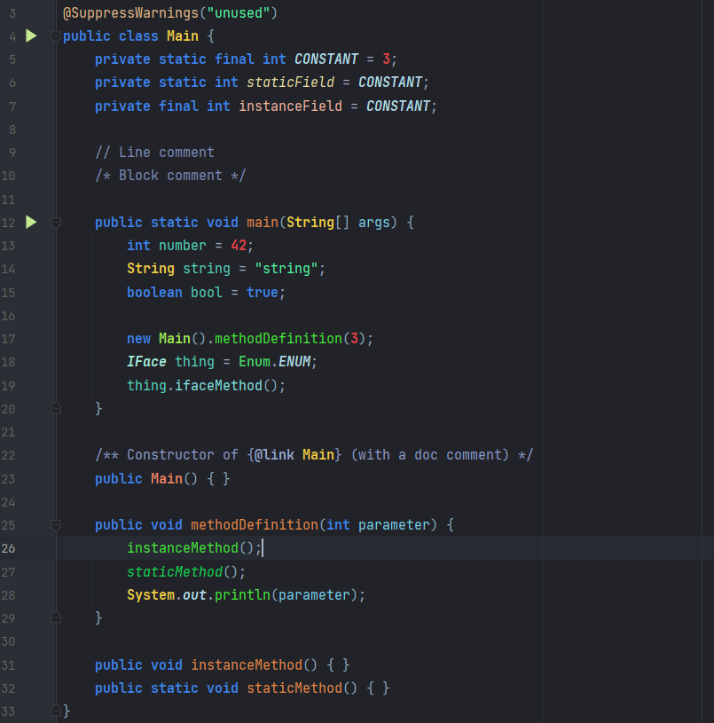
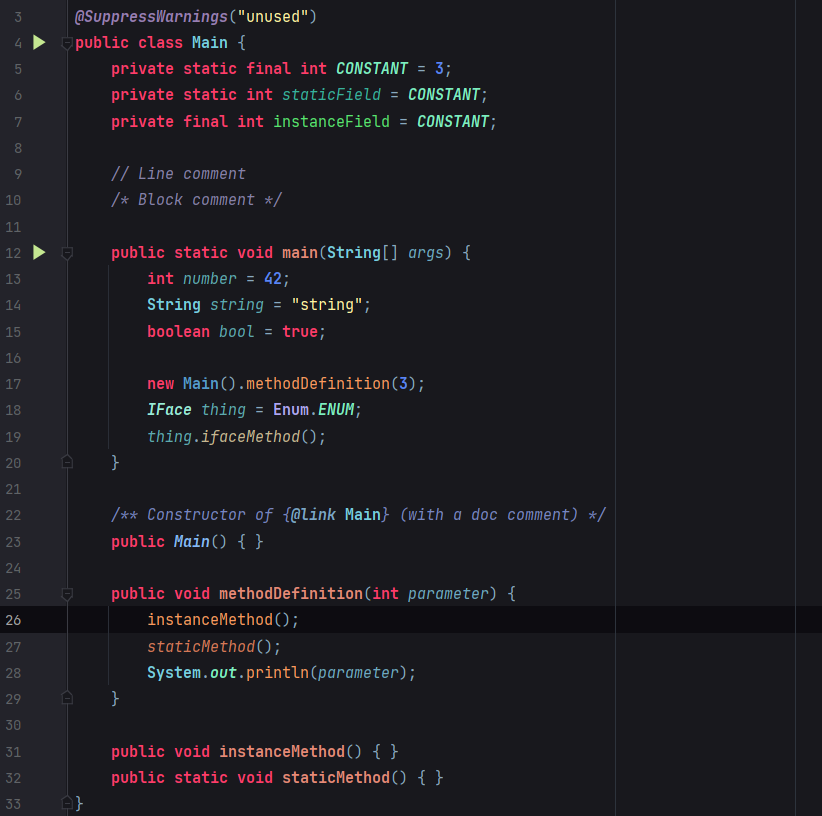

# ShadeCode
A color scheme for IntelliJ and other JetBrains IDE's.

ShadeCode comes in two verions. Version 1 is a colder theme with blue, green and yellow as primary colors. Version 2 is a warmer theme with red, cyan, green and orange as primary colors. Both schemes are designed for Java development, but work for most languages supported by IntelliJ. In other JetBrains IDE (PyCharm, CLion, etc.), you might want to change some colors for some languages.

## ShadeCode 1

## ShadeCode 2

## Licensing
Copyright &copy; 2019-2021 Shadew. All rights reserved.

You may share, modify and redistribute these color schemes in any way preferred, but not without credit to the original author or another license. Use is entirely your own risk, unless required by applicable law. The original author is in no way responsible for any problems caused by using these color schemes.
You may copy or convert these color schemes for use in other IDEs or any other code highlighting context, as long as the original author of the (IntelliJ) color schemes is credited.
